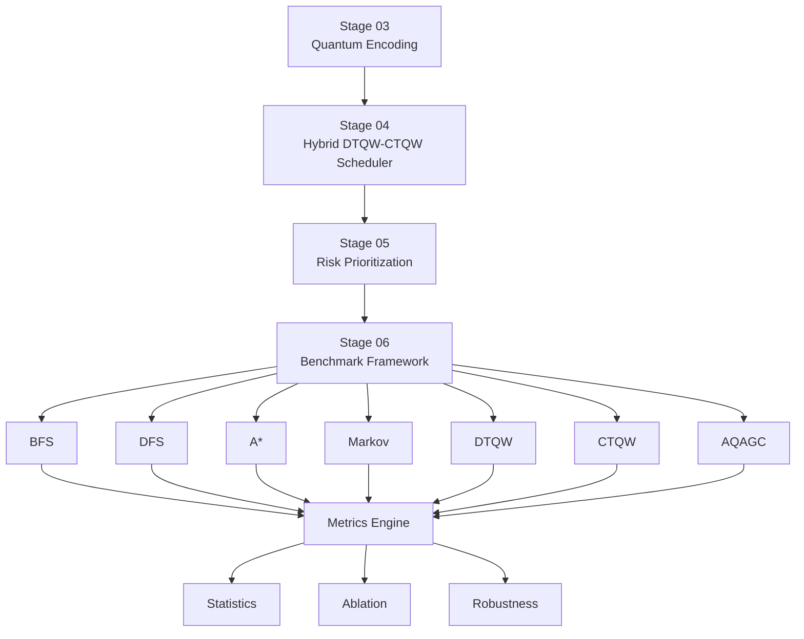

# 🚀 AQAGC Stage 06  
# 📊 Benchmarking and Evaluation Framework

<p align="center">


</p>


<p align="center">

## Adaptive Quantum-Walk-Inspired Attack Graph Compiler (AQAGC)

A complete benchmarking and evaluation framework for
quantum-enhanced attack graph analysis.

</p>


<p align="center">

<a href="#overview">

</a>

<a href="#installation">

</a>

<a href="#execution">

</a>

<a href="#metrics">

</a>

</p>


---

# 🌟 Overview

AQAGC Stage 06 performs the complete benchmarking and evaluation
process for the proposed Adaptive Quantum-Walk-Inspired Attack
Graph Compiler framework.

This stage does not recreate AQAGC.

It consumes the outputs generated from previous stages:

```
Stage 03
Quantum Variational Attack Encoding
        |
        ↓
Stage 04
Hybrid DTQW–CTQW Adaptive Scheduler
        |
        ↓
Stage 05
Risk Prioritization and Attack Path Ranking
        |
        ↓
Stage 06
Benchmarking and Evaluation
```


---

# 🧩 Benchmark Architecture





---

# ⚔️ Benchmark Algorithms


| Algorithm | Category | Description |
|---|---|---|
| 🔍 BFS | Classical | Breadth-first attack graph traversal |
| 🌲 DFS | Classical | Depth-first attack graph traversal |
| ⭐ A* | Classical | Risk-aware path search |
| 🔄 Markov | Probabilistic | Attack transition modelling |
| ⚛️ DTQW | Quantum | Discrete-time quantum walk |
| 🌊 CTQW | Quantum | Continuous-time quantum walk |
| 🚀 AQAGC | Hybrid Quantum | Proposed adaptive framework |


---

# 📂 Repository Structure


```
stage06_benchmarking/

│
├── benchmark_dataset.py
├── benchmark_manager.py
├── benchmark_pipeline.py
├── run_stage06.py
│
├── bfs_baseline.py
├── dfs_baseline.py
├── astar_baseline.py
├── markov_baseline.py
│
├── aqagc_runner.py
├── baseline_runner.py
│
├── ranking_metrics.py
├── quantum_metrics.py
│
├── runtime_profiler.py
├── memory_profiler.py
│
├── scalability_analysis.py
├── robustness_analysis.py
│
├── statistical_analysis.py
├── effect_size.py
├── multiple_comparison.py
│
├── ablation_study.py
│
└── README.md
```


---

# 📊 Evaluation Metrics


## 🎯 Ranking Metrics


| Metric | Description |
|---|---|
| Precision@10 | Top-ranked attack path precision |
| Recall@10 | Critical attack path coverage |
| F1@10 | Ranking balance |
| MAP | Mean Average Precision |
| NDCG@10 | Ranking quality |
| CPC@10 | Critical Path Coverage |


---

## 🧠 Attribution Metrics


| Metric | Description |
|---|---|
| APRS | Attack Path Relevance Score |
| NAS | Node Attribution Score |
| EAS | Edge Attribution Score |
| PAS | Path Attribution Score |
| ACS | Amplitude Concentration Score |
| RCI | Risk Concentration Index |


---

## ⚛️ Quantum Metrics


| Metric | Description |
|---|---|
| QSEG | Quantum Simulation Efficiency Gain |
| Quantum Entropy | Quantum probability distribution analysis |
| αₜ | Adaptive scheduler coefficient behaviour |


---

## ⚡ Performance Metrics


```
⏱ Runtime

🧠 Peak Memory Consumption

🚨 Attack Path Discovery Time (APDT)
```


---

# 🧪 Statistical Evaluation


Implemented statistical validation:

```
✓ Mean

✓ Standard Deviation

✓ 95% Confidence Interval

✓ Paired t-test

✓ Wilcoxon Signed-Rank Test

✓ Holm–Bonferroni Correction

✓ Cohen's d Effect Size
```


---

# 🛡️ Robustness Evaluation


The framework evaluates robustness under:


| Scenario | Description |
|---|---|
| 🕸 Random Edge Removal | Missing attack relationships |
| 🔐 Missing Vulnerability Information | Incomplete security attributes |
| 🌪 Noisy Transition Weights | Uncertain attack probabilities |
| 👁 Partial Graph Visibility | Limited attack knowledge |


---

# 🔬 Ablation Study


AQAGC component contribution analysis:


```
🚀 Full AQAGC

        ↓

❌ Without Adaptive Scheduler

        ↓

❌ Without DTQW

        ↓

❌ Without CTQW

        ↓

⚖️ Fixed Weighting Model
```


---

# ⚙️ Installation


```bash
git clone <repository-url>

cd stage06_benchmarking

pip install -r requirements.txt
```


---

# ▶️ Execution


Run complete benchmarking:


```bash
python run_stage06.py
```


Expected execution:


```
======================================
 AQAGC Stage 06 Benchmarking
======================================

✓ Dataset Loaded

✓ BFS Completed

✓ DFS Completed

✓ A* Completed

✓ Markov Completed

✓ DTQW Completed

✓ CTQW Completed

✓ AQAGC Completed


✓ Metrics Generated

✓ Statistical Analysis Completed

✓ Results Saved
```


---

# 📁 Output Structure


```
data/stage06/

│
├── baseline_results/
│
├── aqagc_results/
│
├── metrics/
│
├── statistics/
│
├── robustness/
│
└── ablation/
```


---

# 🔗 Stage Dependency


```
                 AQAGC Framework


        ┌───────────────────────┐
        │ Stage 03               │
        │ Quantum Encoding       │
        └──────────┬────────────┘
                   ↓

        ┌───────────────────────┐
        │ Stage 04               │
        │ DTQW + CTQW Scheduler  │
        └──────────┬────────────┘
                   ↓

        ┌───────────────────────┐
        │ Stage 05               │
        │ Risk Prioritization    │
        └──────────┬────────────┘
                   ↓

        ┌───────────────────────┐
        │ Stage 06               │
        │ Benchmark Evaluation   │
        └───────────────────────┘
```


---

# 👨‍🔬 Research Reproducibility


Stage 06 enables reproducible comparison between:

```
Classical Search Algorithms

        VS

Quantum Walk Approaches

        VS

Adaptive Hybrid Quantum Framework
```


---

<p align="center">


<br>

<b>
Adaptive Quantum-Walk Intelligence for Attack Graph Analytics
</b>

</p>